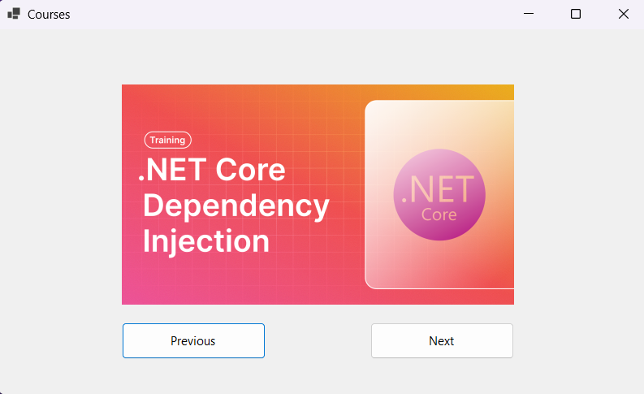
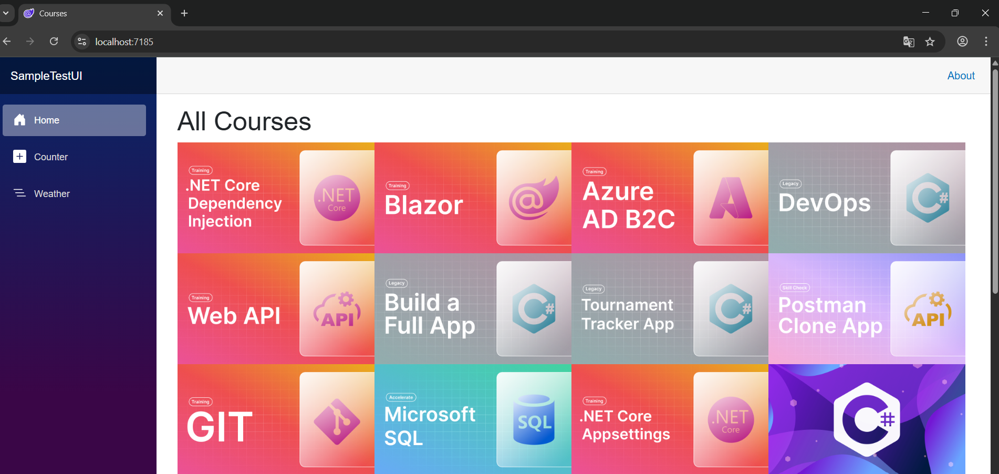

# Practice Project: ASP.NET Web API & Windows Forms

This is a simple practice project I built while following a YouTube tutorial.

You can check the original YouTube tutorial I followed [Building a Sample API](https://www.youtube.com/playlist?list=PLLWMQd6PeGY1TU4qj0UW9iS28j5O-Iwa4).
It consists of two separate applications:

- **ASP.NET Core Web API**  
  Provides access to records from a JSON file through two API endpoints: one returns all entries, and the other returns a single entry by ID.
  Includes a minimal UI (SampleTestUI) that interacts with the API.

- **Windows Forms App**  
  A basic desktop UI that consumes the API. It features "Previous" and "Next" buttons to navigate through images.

---

## Features

### Web API:
- Built with ASP.NET Core (.NET 9)
- Loads a local JSON file
- Filters data and returns results via GET endpoints
- Using Scalar with OpenApi to create RestApi client and document
- Health Checks and Error Codes
- Deploying to a Container and Docker Hub
  

### Windows Forms:
- Connects to the API using `HttpClient`
- Displays images one by one
- Includes "Previous" and "Next" buttons to navigate

---

## How to Run

1. **Start the Web API**
   - Navigate to the `WebAPI` folder
   - Run the project in Visual Studio or via `dotnet run`

2. **Start the WinForms App**
   - Open the `WindowsFormApp` solution
   - Make sure the API URL matches the one running locally (e.g., `https://localhost:7188/api/...`)
   - Run the app

---

## Screenshots

---

## Notes

This project was built for practice purposes and is based on a tutorial.  

